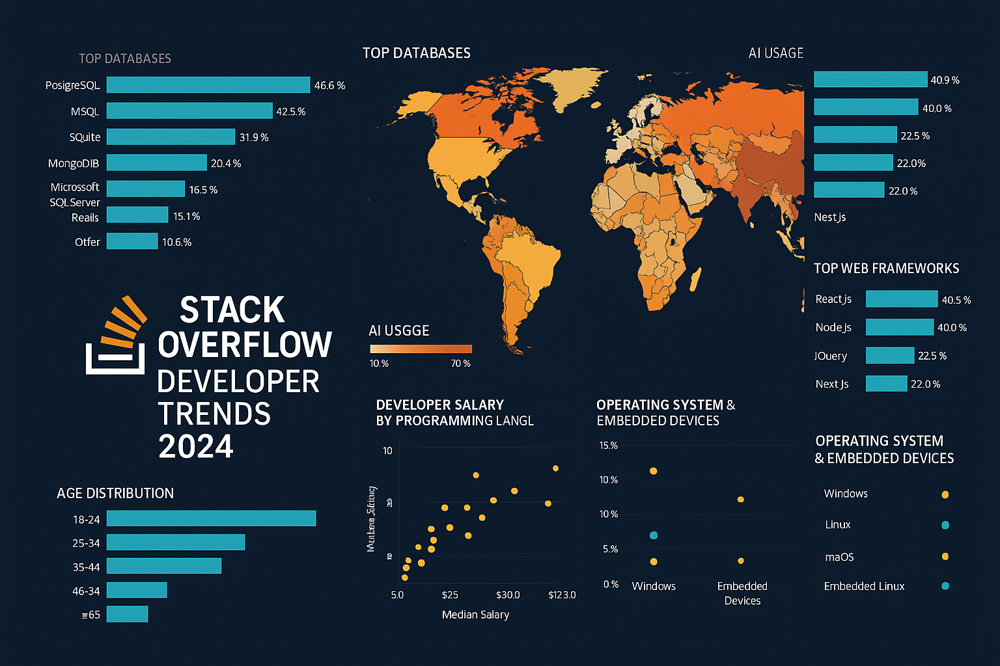
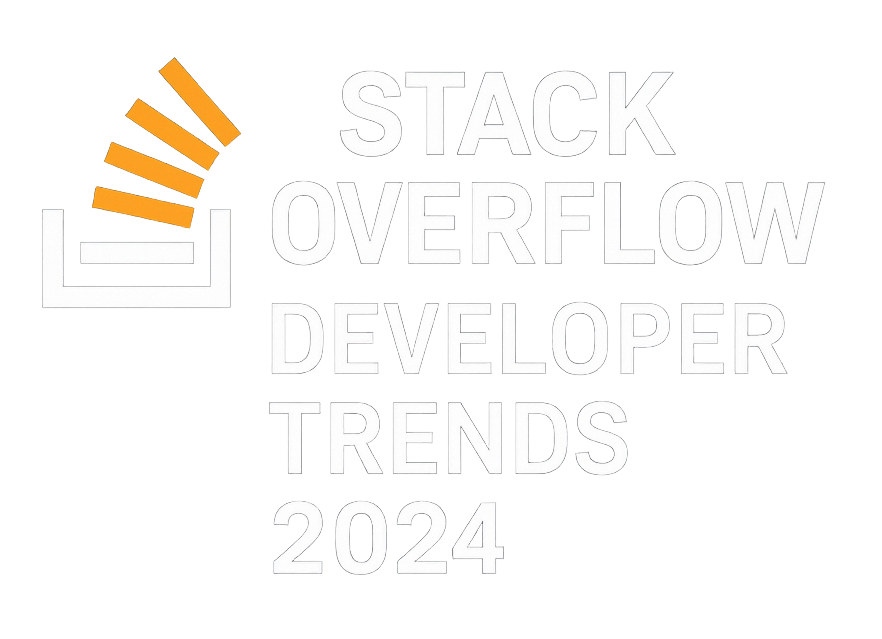
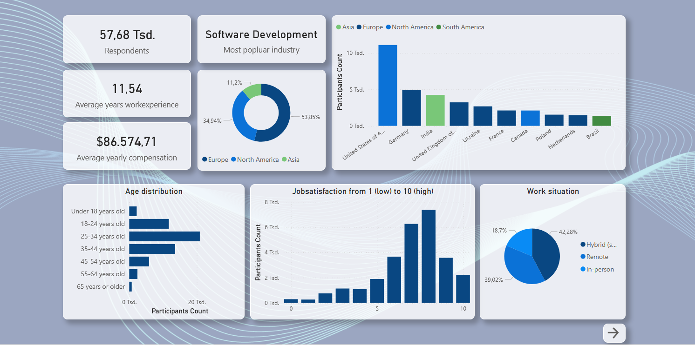
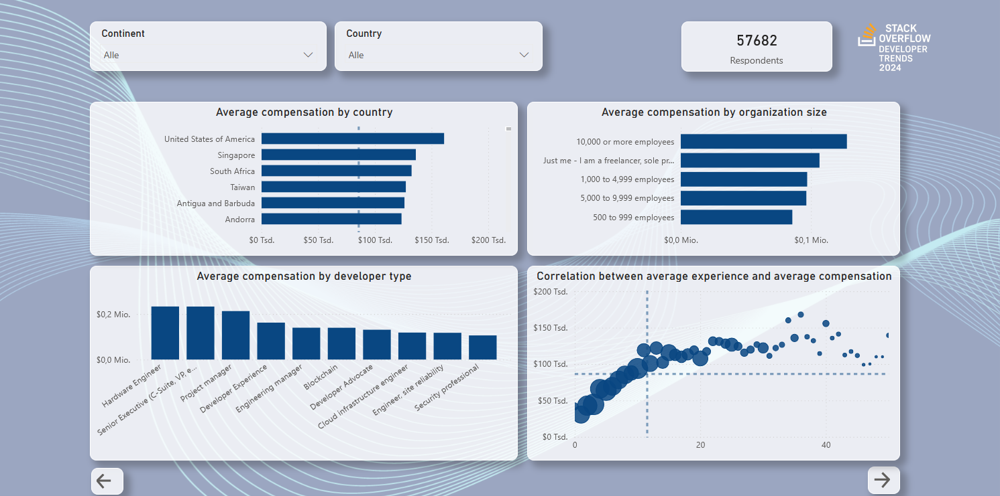
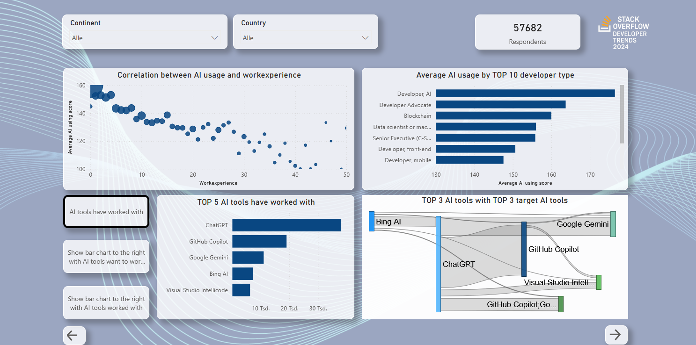
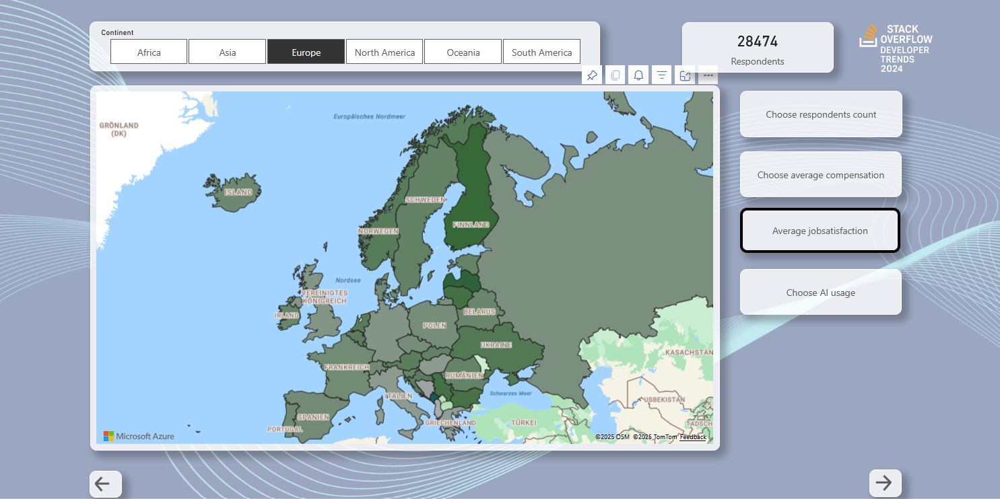

# powerbi-stackoverflow-survey-2024
Visualizing the results of the stack overflow survey 2024 with Power BI

  

  

# 🌍 Stack Overflow Developer Trends 2024 – Power BI Dashboard

Dieses Power BI-Projekt visualisiert die globalen Ergebnisse der **Stack Overflow Developer Survey 2024**. Es bietet interaktive Einblicke in Technologien, Tools und Demografie der weltweiten Entwickler-Community.

---

## 🔍 Inhalt

Das Dashboard beantwortet u. a. folgende Fragen:

- Welche **Programmiersprachen**, **Datenbanken** und **Webframeworks** sind weltweit am beliebtesten?
- Wie stark sind **AI-Tools** (wie ChatGPT, Copilot etc.) in der Entwicklungspraxis angekommen?
- Welche Betriebssysteme und Embedded-Plattformen werden am häufigsten verwendet?
- Wie unterscheiden sich **Gehaltsstrukturen**, **Altersverteilung** und **technologische Vorlieben** je nach Region oder Beruf?
- Welche Korrelationen bestehen zwischen Erfahrung, Technologieeinsatz und Einkommen?

---

## 📊 Features

- 🌐 **Globale Filter**: Nach Region, Beruf, Alter, etc. 
- 📈 **KPIs & Diagramme**: Verbreitung, Trends, Rankings 
- 🗺️ **Interaktive Karten**: Nutzungstrends nach Ländern 
- 🔄 **Vergleich & Korrelationen**: z. B. AI-Nutzung vs. Berufserfahrung 
- 💬 **Visuelle Storytelling-Elemente** 

---

## 🧩 Technologien & Daten

- 📌 **Power BI Desktop (.pbix)** 
- 📁 **Datengrundlage**: [Stack Overflow Survey 2024 (CSV)](https://insights.stackoverflow.com/survey) 
- 🧠 **Verarbeitet mit**: Power Query, DAX, Kartenvisualisierung, Correlation Analysis 

---

## 📸 Weitere Vorschau

 

 
 

---

## 🗂️ Dateien im Repository

| Datei | Beschreibung |
|-------|--------------|
| `stackoverflow2024_dashboard.pbix` | Power BI Report |
| `stackoverflow2024.csv` | Rohdaten (oder Link zur Quelle) |
| `README.md` | Projektbeschreibung |
| `screenshot1.png`, `screenshot2.png` | Vorschau-Bilder |
| `A_logo_in_square_digital_vector_graphic_format_fea.png` | Projektlogo |
| `A_Power_BI_dashboard_in_the_image_visualizes_the_g.png` | Titelbild |

---

## 👥 Zielgruppe

Dieses Projekt richtet sich an:
- Softwareentwickler:innen & Data Analysts
- Personen mit Interesse an Technologie-Trends
- HR, Tech-Strateg:innen & Bildungseinrichtungen
- Bewerbungen / Portfolio-Präsentationen im Bereich IT & Data

---

## 🔗 Weiterführende Links

- [Offizielle Umfrage-Website](https://survey.stackoverflow.co/2024/)
- [Datenquelle Download (Stack Overflow)](https://survey.stackoverflow.co/2024/#download)

---

## 📄 Lizenz

Dieses Projekt basiert auf frei zugänglichen Umfragedaten. Alle Visualisierungen und Analysen wurden selbst erstellt. Die Rechte an den Rohdaten liegen bei Stack Overflow. 
Dieses Repository steht unter der [MIT License](LICENSE).

---

## 🤝 Kontakt

Bei Fragen oder Feedback:
**Markus Elstermann** 
📧 elstermannmarkus@gmail.com
🔗 [LinkedIn](https://www.linkedin.com/)
